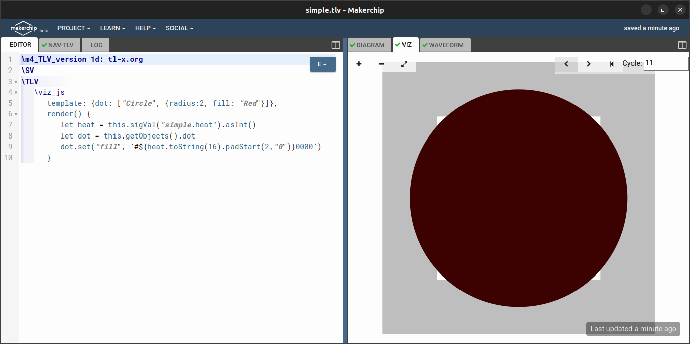
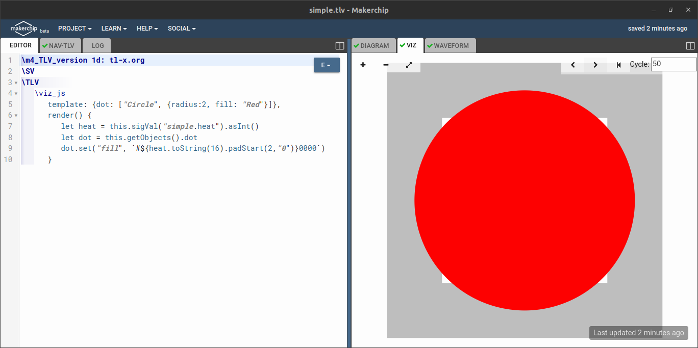
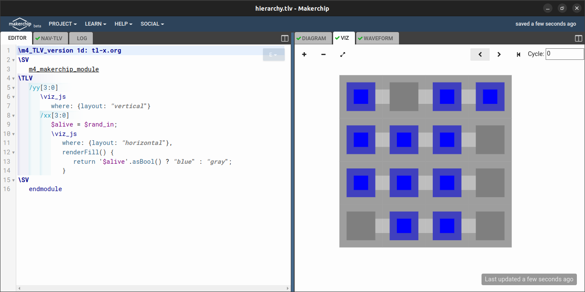
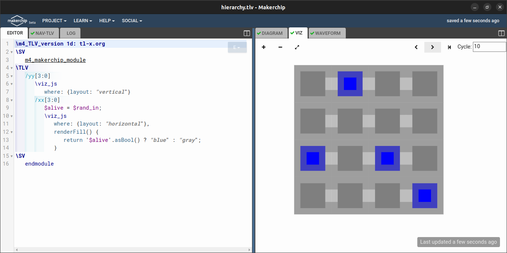
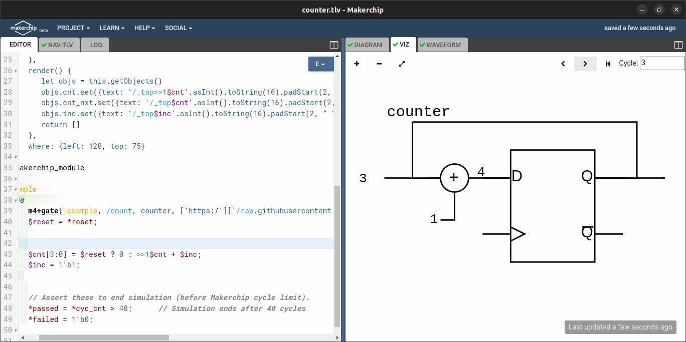

# Makerchip Visual Debug
This section involves example of using VIZ with different designs. For this purpose, different examples have been performed.

## Simple Design Example
This example reads the dumpfile created by a verilog test bench and based on the value of heat signal the circle is filled. For the example the heat signal values are generated by a counter. For running this example installation of `iverilog` and `makerchip-app`. For running this example run the following command.

```bash
make simple
```

We get the following results at cycle 10 and cycle number 50.





## Hierarchy
This example has been taken from the VIZ user manual. Based on the value of `alive` signal for each entry in the 2D array. The color of the cell will be either blue or gray.

We get the following results at cycle 0 and cycle number 10.





## Counter
This counter example is a 4 bit counter with the following results.


